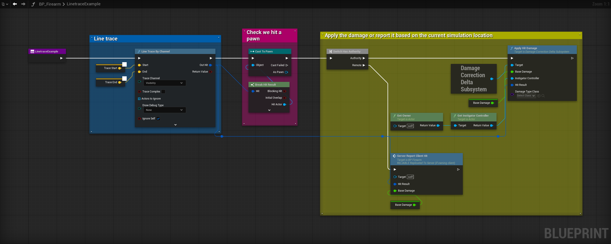
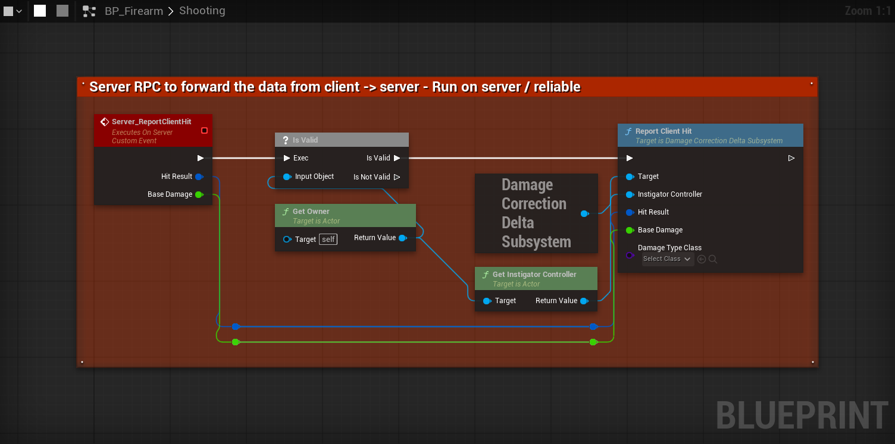
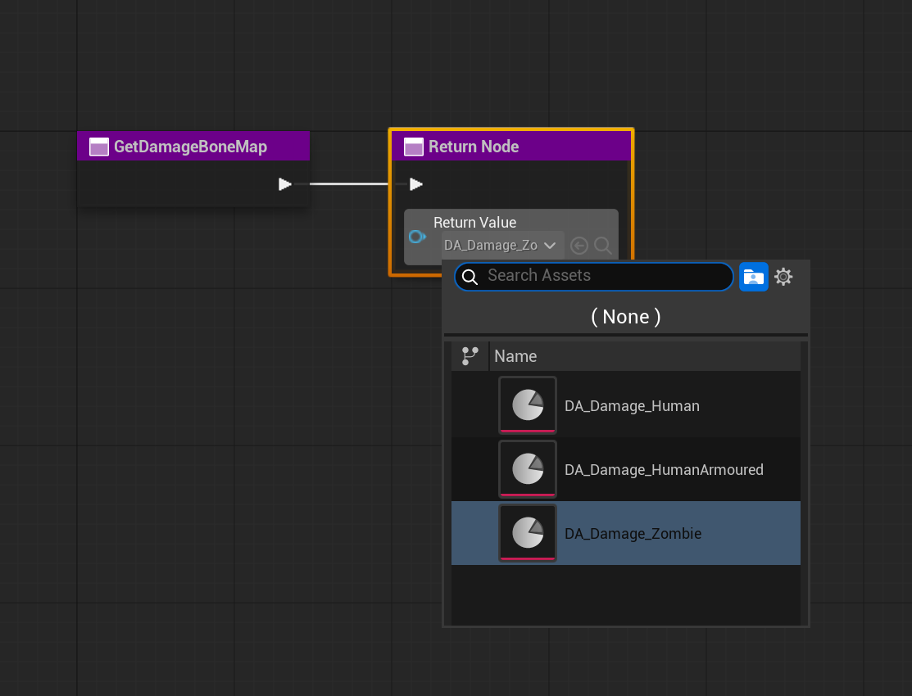
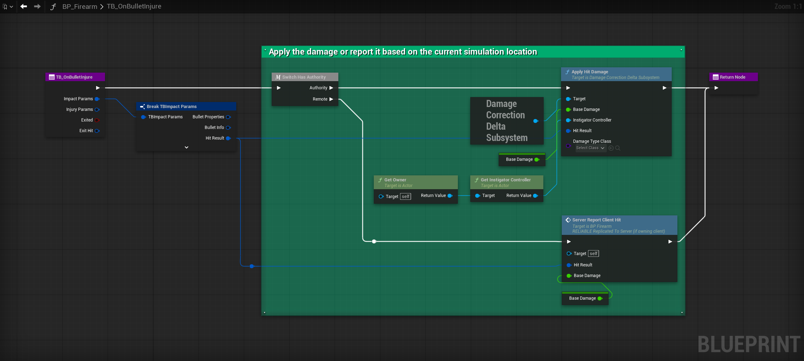

# ClientDamageCorrectionDelta

An Unreal Engine 5 plugin for correcting server-side bone hit registration by using the client's predicted hit as the source of truth for which bone was struck. Designed for PvE co-op games with physics-based projectiles, where server-side collision unreliability (tunnelling, skeletal mesh desync) would otherwise cause headshots to register as body hits.

---

## The Problem

In multiplayer games with simulated projectiles, the server and client run separate physics simulations. A bullet that the client predicts will strike the head may hit a different bone (or nothing) on the server due to:

- Sub-tick tunnelling through thin geometry
- Skeletal mesh pose divergence between client and server
- Network timing differences between the predicted and authoritative projectile

The result is that headshots can register as body hits, or miss entirely.

## How It Works

The plugin introduces a two-RPC model:

1. **Client RPC** - When the client's predicted projectile hits something, it calls `ReportClientHit` on the server, reporting the actor it hit and which bone.
2. **Server projectile** - The authoritative projectile fires normally and calls `ApplyHitDamage` on hit.

The subsystem pairs these two reports per actor using a FIFO queue, applies damage using the client-reported bone for multiplier lookup, and corrects any shortfall between what the server bone would have dealt and what the client bone should deal.

---

## Features

- Three validation modes from fully server-authoritative to fully client-trusted with geometric validation.
- Per-actor first-in first-out queuing so rapid shots pair correctly even when RPCs arrive out of order.
- Modular distance and line-of-sight validation, independently toggleable (LoS check can be disabled for when bullet penetration would block it).
- Capsule-based LoS check - no reliance on skeletal mesh collision, which is unreliable server-side.
- `IDamageBoneMapInterface` to allow for damage multipliers based on hit bones, e.g headshots can multiply the damage 5 times.
- `UDamageBoneMapDataAsset` for configuring per-bone damage multipliers in the editor.
- `DamageIgnoreDelay` guard suppresses double-hits from bullet entry/exit wounds.
- Stale record cleanup via TTL timer.
- All settings configurable in `Project Settings → Plugins → Client Damage Correction Delta`.
- Blueprint-callable.

---

## Screenshots


*An example line trace showing how the damage correction subsystem should be called.*


*The client→server RPC.*


*The damage map interface implementation.*

## Setup

### 1. Configure the validation mode

Open `Project Settings → Plugins → Client Damage Correction Delta` and choose a validation mode (see [Validation Modes](#validation-modes) below).

### 2. Create a Bone Map Data Asset

Right-click in the Content Browser → `Miscellaneous → Data Asset → DamageBoneMapDataAsset`.

Add an entry for each bone you want a custom multiplier for. `DefaultMultiplier` applies to any bone not listed.

| Field | Description |
|---|---|
| `BoneMultipliers` | Array of bone name → multiplier pairs |
| `DefaultMultiplier` | Fallback multiplier for unlisted bones (default: `1.0`) |

Example - human character:
| Bone | Multiplier |
|---|---|
| `head` | `6.0` |
| `neck_01` | `3.0` |
| `neck_02` | `3.0` |
| `spine_05` | `1.5` |

### 3. Implement IDamageBoneMapInterface on your Pawns

In your pawn, add the `DamageBoneMapInterface` interface and implement `GetDamageBoneMap`.

The subsystem queries this interface to decide upon which damage map to use.

### 4. Wire up ReportClientHit

Create a reliable Server RPC and call it when the predicted projectile hits an actor. Inside the Server RPC, call `ReportClientHit` on the `DamageCorrectionDeltaSubsystem`.

```
Get World Subsystem (DamageCorrectionDeltaSubsystem)
→ ReportClientHit
    InstigatorController: The owning player controller
    HitResult:            The client hit result
    BaseDamage:           Your base damage value
    DamageTypeClass:      Your damage type (optional)
```

### 5. Wire up ApplyHitDamage (ServerAuthoritative mode only)

Where you deal damage, replace any existing `ApplyDamage/ApplyPointDamage` calls with `ApplyHitDamage` on the subsystem.

```
Get World Subsystem (DamageCorrectionDeltaSubsystem)
→ ApplyHitDamage
    InstigatorController: The instigating player controller
    HitResult:            The server hit result
    BaseDamage:           Your base damage value
    DamageTypeClass:      Your damage type
```

---

## Validation Modes

### Server Authoritative *(default)*

The server's projectile is required to register a hit. The client RPC only provides the bone name - it does not apply damage on its own. The subsystem pairs the two reports and applies damage using the client bone.

- Best for games where server collision is reliable
- Prevents any damage from being applied if the server projectile misses entirely
- A delta is applied if the client bone earns more damage than the detected server bone did

### Client Authoritative

Damage is applied directly from the client RPC. The server projectile is fired but `ApplyHitDamage` is ignored when the server calls it.

- Best for PvE games with fast or thin projectiles that tunnel server-side
- Fully trusts the client - not suitable for competitive PvP

### Client With Validation

Damage is applied from the client RPC, but the server first performs geometric sanity checks before accepting the hit:

- **Distance check** - rejects hits beyond `MaxValidationRange` from the instigator's eye
- **Line-of-sight check** - performs an `ECC_Visibility` trace from the instigator's eye to the target's capsule center; rejects if blocked by world geometry

Both checks are independently toggleable. Disable line-of-sight if your game uses bullet penetration through surfaces.

The LoS trace targets the capsule component center rather than the exact impact point, because skeletal mesh pose on the server is not guaranteed to match the client's.

---

## Settings Reference

All settings are available in `Project Settings → Plugins → Client Damage Correction Delta` and can also be overridden at runtime on the subsystem's public properties.

| Setting | Type | Default | Description |
|---|---|---|---|
| `ValidationMode` | Enum | `ServerAuthoritative` | Controls which path applies damage |
| `bValidateDistance` | bool | `true` | Reject hits beyond `MaxValidationRange` *(ClientWithValidation only)* |
| `MaxValidationRange` | float (cm) | `150000` (1500 m) | Maximum valid hit distance *(ClientWithValidation only)* |
| `bValidateLineOfSight` | bool | `true` | Reject hits with no server-side LoS *(ClientWithValidation only)* |
| `DamageIgnoreDelay` | float (s) | `0.05` | Prevents a single bullet registering as multiple hits when client and server physics resolve in different frames |
| `RecordTTL` | float (s) | `5.0` | Seconds before an unmatched pending record is discarded |

---

## API Reference

### UDamageCorrectionDeltaSubsystem

| Function                                                                        | Description |
|---------------------------------------------------------------------------------|---|
| `ReportClientHit(InstigatorController, HitResult, BaseDamage, DamageTypeClass)` | Call from a reliable Server RPC in your client-predicted projectile when it hits an actor |
| `ApplyHitDamage(InstigatorController, HitResult, BaseDamage, DamageTypeClass)`  | Call from your server-authoritative projectile's hit, in place of ApplyPointDamage |

### IDamageBoneMapInterface

| Function | Description |
|---|---|
| `GetDamageBoneMap()` | Implement on your Pawn to return the bone map asset for that pawn type |

### UDamageBoneMapDataAsset

| Function | Description |
|---|---|
| `GetMultiplierForBone(BoneName)` | Returns the multiplier for a bone, or `DefaultMultiplier` if not listed |
| `CalculateDamage(BaseDamage, BoneName)` | Returns `BaseDamage * GetMultiplierForBone(BoneName)` |

---

## Notes

- This plugin is designed for **PvE co-op** scenarios. `ClientAuthoritative` mode gives full trust to the client and should not be used in competitive PvP without additional anti-cheat measures.
- The de-duplication guard (`DamageIgnoreDelay`) uses a flat per-actor timestamp, not per-instigator. Two different players hitting the same actor within the delay window counts as one event. If you need per-instigator de-duplication, this can be extended by keying `LastHitTime` on `(actor, instigator)` pairs.
- If using Terminal Ballistics, you can utilise the `OnBulletInjure` event as it mainly fires on pawns (amongst other things - see ["Injury"](https://github.com/ErikHedberg/Terminal-Ballistics-Example-Project/wiki#advanced-usage-callbacks) for more details).

*Example TerminalBallistics implementation.*
